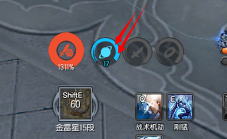

<!--
author: yanliang.zhao
head: http://blog.itttl.com/logo_miao.png
date: 2021-11-22
title: 雷剑一闪转身取色宏2.0.1-free新增魂星同步取色配置文件
tags: bns,autohotkey
category: autohotkey
status: publist
summary: 雷剑一闪转身取色宏free
-->


## 2.0.1 ---更新2021-12-09-145552---
* 新增取色配置文件,首次取色自动生成，存放在宏同级别目录
* 新增魂星同步，F1取色，侧键1，侧键2使用期间触发
* 御天剑判定改为山崩地裂z
* 取色配置改为首次启动宏读取

### 使用说明
* 侧键1：t r tab 4 循环卡到
* 侧键2：v t 转身 循环卡
* F1：魂魂增益图标取色，光环2点位置
* 小键盘数字1：山崩地裂z取色(12点偏左一点点)
* 小键盘数字2：普通一闪v取色(12点偏右一点点)
* 小键盘数字3：闪烁一闪v取色(12点偏右一点点)
* 取色配置为宏文件存放位置同级目录下的config.ini
* 分辨率1768x992,窗口模式【分辨率不同可能需要调整转身鼠标滑动数值mouseXY(1590,0),可以通过F12地板直线线条测试转身是否为180度】
* 【PS：确保小键盘数字按键1 2 3未设置游戏按键，t为鼠标右键，r鼠标左键，魂星同步需触发卡刀过程（即使用侧键1卡刀，或者侧键2打一闪的过程）才能触发。】

### 宏及相关工具下载
* 取色宏工具AutoHotKey.exe下载 [AutoHotKey.exe][201] 需要自己编辑脚本内容到工具运行
* 剑士一闪转身宏2.0.1集成代码一键运行文件下载 [twokeyquse-2.0.1.exe][302],需要分辨率1768x992,窗口模式,转轴速度30 20;
* 魂星同步取色宏,全职业通用,单独的宏工具，雷剑一闪转身宏已经集成不需要单独开[魂星同步-1.0.2-鼠标侧键2开关F1取色.exe][303]
* 魂星超神同步取色宏,斗士专用[魂星超神同步-1.0.2-鼠标侧键2开关F1取色.exe][304]

### 取色位置
* 1.魂星同步宏取色位置

* 2.普通一闪取色位置,待补充

### 取色方法
* 进入F12修炼场，召唤莫乌镇，按i调出背包
* 将鼠标光标放到对应技能的取色位置，然后按下取色按键
* 取色成功会有success+取色坐标+颜色提示
* 所有技能取色成功后,到宏工具目录下备份config.ini,窗口大小及UI设定不变的情况下，取色配置永久有效，不需要每次启动都重新取色。
* 附上我的取色配置内容，不能直接复用，仅供好奇的小伙伴对比
```
[Section]
huncdx=627
huncdy=800
huncdc=0x11C0FF
sxjx=832
sxjy=917
sxjc=0xC1C1C0
ptysx=956
ptysy=917
ptysc=0xD5EAEF
ssysx=958
ssysy=918
ssysc=0xCAB597
```

[302]:https://www.itttl.com/blog/img/twokeyquse-2.0.1.exe
[303]:https://www.itttl.com/blog/img/魂星同步-1.0.2-鼠标侧键2开关F1取色.exe
[304]:https://www.itttl.com/blog/img/魂星超神同步-1.0.2-鼠标侧键2开关F1取色.exe


### 雷剑一闪转身取色宏2.0.1源码(取色配置改为首次启动读取)
```
#IfWinActive ahk_class UnrealWindow
#SingleInstance,Force
#MaxThreadsPerHotkey 3
SetKeyDelay,5
#MaxHotkeysPerInterval 9999

IniRead, ptysx, config.ini, Section, ptysx
IniRead, ptysy, config.ini, Section, ptysy
IniRead, ptysc, config.ini, Section, ptysc

IniRead, ssysx, config.ini, Section, ssysx
IniRead, ssysy, config.ini, Section, ssysy
IniRead, ssysc, config.ini, Section, ssysc

IniRead, sxjx, config.ini, Section, sxjx
IniRead, sxjy, config.ini, Section, sxjy
IniRead, sxjc, config.ini, Section, sxjc

XButton2::
loop {
  gosub xz
  if(GetColor(ptysx,ptysy)=ptysc or GetColor(ssysx,ssysy)=ssysc) {
    if(GetColor(sxjx,sxjy)=sxjc) {
      gosub nvtzs
    }
    else {
      gosub yvtzs
    }
  }
}Until Not getkeystate("XButton2","P")
return

XButton1::
loop {
  gosub xz
  SendInput t
  SendInput r
  ;send c
  send {tab}
  Sleep 20
  send 4
}Until Not getkeystate("XButton1","P")
return

;御天剑VT转身
yvtzs:
Sendinput v
;按一闪转身时间，单位ms
Sleep 210
;鼠标滑动
mouseXY(1590,0)
Sendinput t
Sleep 500
return

;无御天剑VT转身
nvtzs:
Sendinput v
;按一闪转身时间，单位ms
Sleep 210
;鼠标滑动
mouseXY(1590,0)
Sleep 300
Sendinput t
Sleep 400
return

;魂星同步
xz:
  if(GetColor(huncdx,huncdy)=huncdc) {
    Sendinput {``}
  }
return

mouseXY(x,y) {
  DllCall("mouse_event",uint,1,int,x,int,y,uint,0,int,0)
}
return

GetColor(x,y)
{
  PixelGetColor, color, x, y, RGB
  StringRight color,color,10
  return color
}
Return

Numpad1::
MouseGetPos, mouseX, mouseY
PixelGetColor, color, %mouseX%, %mouseY%, RGB
StringRight color,color,10 ;
sxjx = %mouseX%
sxjy = %mouseY%
sxjc = %color%
IniWrite, %mouseX%, config.ini, Section, sxjx
IniWrite, %mouseY%, config.ini, Section, sxjy
IniWrite, %color%, config.ini, Section, sxjc
tooltip success: %sxjx% %sysy% %sxjc% ;山崩地裂z取色,5s后关闭该提醒
SetTimer, RemoveToolTip, 5000
return

Numpad2::
MouseGetPos, mouseX, mouseY
PixelGetColor, color, %mouseX%, %mouseY%, RGB
StringRight color,color,10 ;
ptysx = %mouseX%
ptysy = %mouseY%
ptysc = %color%
IniWrite, %mouseX%, config.ini, Section, ptysx
IniWrite, %mouseY%, config.ini, Section, ptysy
IniWrite, %color%, config.ini, Section, ptysc
tooltip success: %ptysx% %ptysy% %ptysc% ;普通一闪v取色,5s后关闭该提醒
SetTimer, RemoveToolTip, 5000
return

Numpad3::
MouseGetPos, mouseX, mouseY
PixelGetColor, color, %mouseX%, %mouseY%, RGB
StringRight color,color,10 ;
ssysx = %mouseX%
ssysy = %mouseY%
ssysc = %color%
IniWrite, %mouseX%, config.ini, Section, ssysx
IniWrite, %mouseY%, config.ini, Section, ssysy
IniWrite, %color%, config.ini, Section, ssysc
tooltip success: %ssysx% %ssysy% %ssysc% ;闪烁一闪v取色,5s后关闭该提醒
SetTimer, RemoveToolTip, 5000
return

F1::
MouseGetPos, mouseX, mouseY
PixelGetColor, color, %mouseX%, %mouseY%, RGB
StringRight color,color,10 ;
huncdx = %mouseX%
huncdy = %mouseY%
huncdc = %color%
IniWrite, %mouseX%, config.ini, Section, huncdx
IniWrite, %mouseY%, config.ini, Section, huncdy
IniWrite, %color%, config.ini, Section, huncdc
tooltip success: %huncdx% %huncdy% %huncdc% ;魂取色,5s后关闭该提醒
SetTimer, RemoveToolTip, 5000
return

RemoveToolTip:
SetTimer, RemoveToolTip, Off
ToolTip
return

```
---
### 雷剑一闪转身取色宏2.0.0源码

```
#IfWinActive ahk_class UnrealWindow
#SingleInstance,Force
#MaxThreadsPerHotkey 3
SetKeyDelay,5
#MaxHotkeysPerInterval 9999
global ptysx,ptysy,ptysc
XButton2::
loop {
  IniRead, ptysx, config.ini, Section, ptysx
  IniRead, ptysy, config.ini, Section, ptysy
  IniRead, ptysc, config.ini, Section, ptysc

  IniRead, ssysx, config.ini, Section, ssysx
  IniRead, ssysy, config.ini, Section, ssysy
  IniRead, ssysc, config.ini, Section, ssysc

  IniRead, sxjx, config.ini, Section, sxjx
  IniRead, sxjy, config.ini, Section, sxjy
  IniRead, sxjc, config.ini, Section, sxjc
  gosub xz
  if(GetColor(ptysx,ptysy)=ptysc or GetColor(ssysx,ssysy)=ssysc) {
    if(GetColor(sxjx,sxjy)=sxjc) {
      gosub nvtzs
    }
    else {
      gosub yvtzs
    }
  }
}Until Not getkeystate("XButton2","P")
return

XButton1::
loop {
  gosub xz
  SendInput t
  SendInput r
  ;send c
  send {tab}
  Sleep 20
  send 4
}Until Not getkeystate("XButton1","P")
return

;御天剑VT转身
yvtzs:
Sendinput v
;按一闪转身时间，单位ms
Sleep 210
;鼠标滑动
mouseXY(1590,0)
Sendinput t
Sleep 500
return

;无御天剑VT转身
nvtzs:
Sendinput v
;按一闪转身时间，单位ms
Sleep 210
;鼠标滑动
mouseXY(1590,0)
Sleep 300
Sendinput t
Sleep 400
return

;魂星同步
xz:
  IniRead, huncdx, config.ini, Section, huncdx
  IniRead, huncdy, config.ini, Section, huncdy
  IniRead, huncdc, config.ini, Section, huncdc
  if(GetColor(huncdx,huncdy)=huncdc) {
    Sendinput {``}
  }
return

mouseXY(x,y) {
  DllCall("mouse_event",uint,1,int,x,int,y,uint,0,int,0)
}
return

GetColor(x,y)
{
  PixelGetColor, color, x, y, RGB
  StringRight color,color,10
  return color
}
Return

Numpad1::
MouseGetPos, mouseX, mouseY
PixelGetColor, color, %mouseX%, %mouseY%, RGB
StringRight color,color,10 ;
sxjx = %mouseX%
sxjy = %mouseY%
sxjc = %color%
IniWrite, %mouseX%, config.ini, Section, sxjx
IniWrite, %mouseY%, config.ini, Section, sxjy
IniWrite, %color%, config.ini, Section, sxjc
tooltip success: %sxjx% %sysy% %sxjc% ;山崩地裂z取色,5s后关闭该提醒
SetTimer, RemoveToolTip, 5000
return

Numpad2::
MouseGetPos, mouseX, mouseY
PixelGetColor, color, %mouseX%, %mouseY%, RGB
StringRight color,color,10 ;
ptysx = %mouseX%
ptysy = %mouseY%
ptysc = %color%
IniWrite, %mouseX%, config.ini, Section, ptysx
IniWrite, %mouseY%, config.ini, Section, ptysy
IniWrite, %color%, config.ini, Section, ptysc
tooltip success: %ptysx% %ptysy% %ptysc% ;普通一闪v取色,5s后关闭该提醒
SetTimer, RemoveToolTip, 5000
return

Numpad3::
MouseGetPos, mouseX, mouseY
PixelGetColor, color, %mouseX%, %mouseY%, RGB
StringRight color,color,10 ;
ssysx = %mouseX%
ssysy = %mouseY%
ssysc = %color%
IniWrite, %mouseX%, config.ini, Section, ssysx
IniWrite, %mouseY%, config.ini, Section, ssysy
IniWrite, %color%, config.ini, Section, ssysc
tooltip success: %ssysx% %ssysy% %ssysc% ;闪烁一闪v取色,5s后关闭该提醒
SetTimer, RemoveToolTip, 5000
return

F1::
MouseGetPos, mouseX, mouseY
PixelGetColor, color, %mouseX%, %mouseY%, RGB
StringRight color,color,10 ;
huncdx = %mouseX%
huncdy = %mouseY%
huncdc = %color%
IniWrite, %mouseX%, config.ini, Section, huncdx
IniWrite, %mouseY%, config.ini, Section, huncdy
IniWrite, %color%, config.ini, Section, huncdc
tooltip success: %huncdx% %huncdy% %huncdc% ;魂取色,5s后关闭该提醒
SetTimer, RemoveToolTip, 5000
return

RemoveToolTip:
SetTimer, RemoveToolTip, Off
ToolTip
return
```
---
---
## 1.1.1更新于2021-11-03 御天剑期间加速vt,非御天剑期间vt延迟保证夺命剑正常应用
* 侧键1：t r tab 4 循环卡到
* 侧键2：v t 转身 循环卡
* 小键盘数字1：碎心脚取色(12点偏左一点点)
* 小键盘数字2：普通一闪取色(12点偏右一点点)
* 小键盘数字3：闪烁一闪取色(12点偏右一点点)
* 分辨率1768x992,窗口模式【分辨率不同可能需要调整转身鼠标滑动数值mouseXY(1590,0),可以通过F12地板直线线条测试转身是否为180度】
* 【PS：确保小键盘数字按键1 2 3未设置游戏按键，t为鼠标右键，r鼠标左键】
* 取色宏工具AutoHotKey.exe下载 [AutoHotKey.exe][201] 需要自己编辑脚本内容到工具运行
* 集成代码一键运行文件下载 [twokeyquse-1.1.1.exe][202]
[201]:https://www.itttl.com/blog/img/AutoHotKey.exe
[202]:https://www.itttl.com/blog/img/twokeyquse-1.1.1.exe

### 雷剑一闪转身取色宏1.1.1源码

```
#IfWinActive ahk_class UnrealWindow
#SingleInstance,Force
#MaxThreadsPerHotkey 3
SetKeyDelay,5
#MaxHotkeysPerInterval 9999
global ptysx,ptysy,ptysc
XButton2::
loop {
  if(GetColor(ptysx,ptysy)=ptysc or GetColor(ssysx,ssysy)=ssysc) {
    if(GetColor(sxjx,sxjy)=sxjc) {
      gosub nvtzs
    }
    else {
      gosub yvtzs
    }
  }
}Until Not getkeystate("XButton2","P")
return

XButton1::
loop {
  SendInput t
  SendInput r
  ;send c
  send {tab}
  Sleep 20
  send 4
}Until Not getkeystate("XButton1","P")
return

;御天剑VT转身
yvtzs:
Sendinput v
;按一闪转身时间，单位ms
Sleep 150
;鼠标滑动
mouseXY(1590,0)
Sendinput t
Sleep 200
return

;无御天剑VT转身
nvtzs:
Sendinput v
;按一闪转身时间，单位ms
Sleep 150
;鼠标滑动
mouseXY(1590,0)
Sleep 200
Sendinput t
Sleep 200
return


mouseXY(x,y) {
  DllCall("mouse_event",uint,1,int,x,int,y,uint,0,int,0)
}
return

GetColor(x,y)
{
  PixelGetColor, color, x, y, RGB
  StringRight color,color,10
  return color
}
Return

Numpad2::
MouseGetPos, mouseX, mouseY
PixelGetColor, color, %mouseX%, %mouseY%, RGB
StringRight color,color,10 ;
ptysx = %mouseX%
ptysy = %mouseY%
ptysc = %color%
tooltip success: %ptysx% %ptysy% %ptysc% ;普通一闪取色,5s后关闭该提醒
SetTimer, RemoveToolTip, 5000
return

Numpad3::
MouseGetPos, mouseX, mouseY
PixelGetColor, color, %mouseX%, %mouseY%, RGB
StringRight color,color,10 ;
ssysx = %mouseX%
ssysy = %mouseY%
ssysc = %color%
tooltip success: %ssysx% %ssysy% %ssysc% ;闪烁一闪取色,5s后关闭该提醒
SetTimer, RemoveToolTip, 5000
return

Numpad1::
MouseGetPos, mouseX, mouseY
PixelGetColor, color, %mouseX%, %mouseY%, RGB
StringRight color,color,10 ;
sxjx = %mouseX%
sxjy = %mouseY%
sxjc = %color%
tooltip success: %sxjx% %sysy% %sxjc% ;碎心脚取色,5s后关闭该提醒
SetTimer, RemoveToolTip, 5000
return

RemoveToolTip:
SetTimer, RemoveToolTip, Off
ToolTip
return

```

---

## 1.0.1更新于2021-11-01 (不判断御天剑版本)
* 侧键1：t r tab 4 循环卡到
* 侧键2：v t 转身 循环卡
* 数字9：普通一闪取色
* 数字0：闪烁一闪取色
* 分辨率1768x992,窗口模式【分辨率不同可能需要调整转身鼠标滑动数值mouseXY(1590,0)】
* 【PS：确保0 9 按键未设置游戏按键，t为鼠标右键，r鼠标左键】

```bash
#IfWinActive ahk_class UnrealWindow
#SingleInstance,Force
#MaxThreadsPerHotkey 3
SetKeyDelay,5
#MaxHotkeysPerInterval 9999
global ptysx,ptysy,ptysc
XButton2::
loop {
  if(GetColor(ptysx,ptysy)=ptysc) {
    gosub vtzs
  }
  else if(GetColor(ssysx,ssysy)=ssysc) {
    gosub vtzs
  }
}Until Not getkeystate("XButton2","P")
return

XButton1::
loop {
  SendInput t
  SendInput r
  ;send c
  send {tab}
  Sleep 20
  send 4
}Until Not getkeystate("XButton1","P")
return

;VT转身
vtzs:
Sendinput v
;按一闪转身时间，单位ms
Sleep 150
;鼠标滑动
mouseXY(1590,0)
Sendinput t
Sleep 200
return

mouseXY(x,y) {
  DllCall("mouse_event",uint,1,int,x,int,y,uint,0,int,0)
}
return

GetColor(x,y)
{
  PixelGetColor, color, x, y, RGB
  StringRight color,color,10
  return color
}
Return

9::
MouseGetPos, mouseX, mouseY
PixelGetColor, color, %mouseX%, %mouseY%, RGB
StringRight color,color,10 ;
ptysx = %mouseX%
ptysy = %mouseY%
ptysc = %color%
tooltip success: %ptysx% %ptysy% %ptysc% ;普通一闪取色,5s后关闭该提醒
SetTimer, RemoveToolTip, 5000
return

0::
MouseGetPos, mouseX, mouseY
PixelGetColor, color, %mouseX%, %mouseY%, RGB
StringRight color,color,10 ;
ssysx = %mouseX%
ssysy = %mouseY%
ssysc = %color%
tooltip success: %ssysx% %ssysy% %ssysc% ;闪烁一闪取色,5s后关闭该提醒
SetTimer, RemoveToolTip, 5000
return

RemoveToolTip:
SetTimer, RemoveToolTip, Off
ToolTip
return
```
