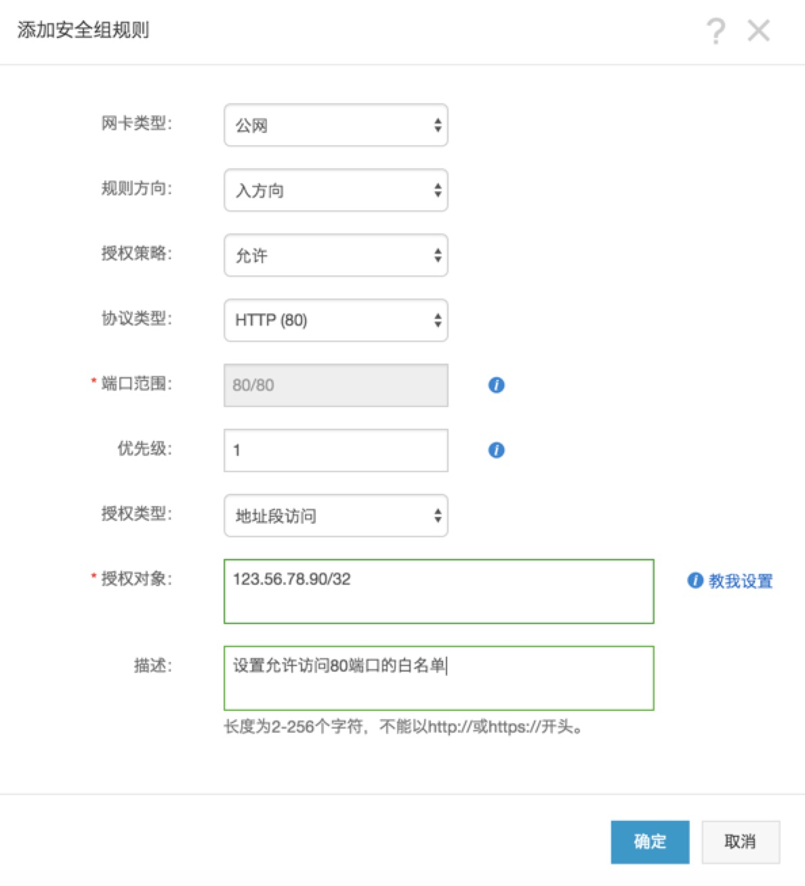
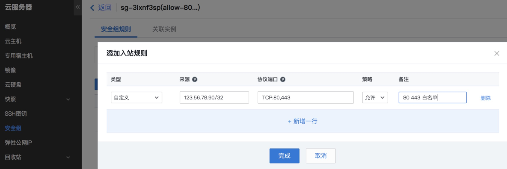

<!--
author: yanliang.zhao
head: http://blog.itttl.com/logo_miao.png
date: 2018-01-23
title: 配置白名单的几种方式
tags: 白名单
category: Linux
status: publist
summary: 配置白名单的几种方式
-->

# 配置白名单的几种方式 #
## Nginx
### 1、模块
实际上deny和allow指令属于ngx_http_access_module.我们想控制某个uri或者一个路径不让人访问
这个模块内置在了nginx中，除非你安装中使用了--without-http_access_module。

### 2、指令
#### allow
 - 语法:    allow address | CIDR | unix: | all;
 - 默认值:   —
 - 配置段:  http, server, location, limit_except
 - 描述: 允许某个ip或者一个ip段访问.

### deny
 - 语法:     deny address | CIDR | unix: | all;
 - 默认值:     —
 - 配置段:     http, server, location, limit_except
 - 描述：禁止某个ip或者一个ip段访问.

### 3.allow、deny实例
```
location / {
    deny  192.168.1.1;
    allow 192.168.1.0/24;
    allow 10.1.1.0/16;
    allow 2001:0db8::/32;
    deny  all;
}
```
从上到下的顺序，类似iptables。匹配到了便跳出。
如上的例子先禁止了192.16.1.1，接下来允许了3个网段，其中包含了一个ipv6，最后未匹配的IP全部禁止访问.

## Apache
通过apache的虚拟主机配置文件httpd.conf来控制，本方法适用于自己架设的服务器，一般虚拟主机是不能接触到httpd.conf文件的。

### 白名单，仅允许192.168.0.1以及192.168.1.1-192.168.1.255访问
```
<Directory "/data/omc-server">
    Options Indexes FollowSymLinks Includes ExecCGI
    AllowOverride All
    #以下为关键代码
    Order Deny,Allow
    Allow from 192.168.0.1
    Allow from 192.168.1.0/24
    Deny from All
</Directory>
```
### 黑名单，禁止192.168.0.1以及192.168.1.1-192.168.1.255访问
```
<Directory "/data/omc-server">
    Options Indexes FollowSymLinks Includes ExecCGI
    AllowOverride All
    #以下为关键代码
    order allow,deny
    allow from all
    deny from 192.168.0.1
    deny from 192.168.1.
</Directory>
```
PS：192.168.1.0/24与192.168.1. 等价，仅为不同书写格式。


## 阿里云安全组

### 1.新增安全组

登录阿里云-->控制台-->云服务器ECS-->网络和安全-->安全组-->创建安全组-->输入安全组名字、选择网络-->公网入方向-->添加安全组规则-->选择TCP 80端口-->授权对象（123.56.78.90/32）-->确定


授权对象格式为:IP/掩码
单个公网IP的掩码可直接设置为32
### 2.绑定安全组至云服务器
控制台-->云服务器ECS-->选择需要加白名单的主机-->本地安全组-->加入安全组-->选择刚刚新增的安全组即可


## 腾讯云安全组
### 1.新增安全组
登录-->控制台-->云服务器-->安全组-->新建-->输入安全组名等基本信息-->确定-->立即设置规则-->自定义-->来源（123.56.78.90/32）-->选择协议及端口TCP:80-->允许-->确定


### 2.绑定安全组至云服务器
控制台-->云服务器-->云主机-->选择需要加白名单的主机-->安全组-->绑定-->勾选刚刚添加的安全组-->确定
