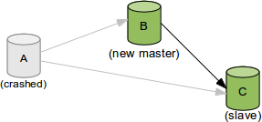

<!--
author: yanliang.zhao
head: http://blog.itttl.com/logo_miao.png
date: 2015-12-02
title: MySQL5.6基于GTID的AB复制(主从&主主)
tags: MySQL主从，AB复制，MySQL5.6
category: MySQL
status: publist
summary: MySQL5.6基于GTID的AB复制
-->

#

### GTID简介

### 什么是GTID

GTID(Global Transaction ID)是对于一个已提交事务的编号，并且是一个全局唯一的编号。 
GTID实际上是由UUID+TID组成的。其中UUID是一个MySQL实例的唯一标识。TID代表了该实例上已经提交的事务数量，并且随着事务提交单调递增。下面是一个GTID的具体形式  
```
3E11FA47-71CA-11E1-9E33-C80AA9429562:23
```
更详细的介绍可以参见：[官方文档][102]

### GTID的作用

#### 那么GTID功能的目的是什么呢？具体归纳主要有以下两点：

 - 根据GTID可以知道事务最初是在哪个实例上提交的
 - GTID的存在方便了Replication的Failover
这里详细解释下第二点。我们可以看下在MySQL 5.6的GTID出现以前replication failover的操作过程。假设我们有一个如下图的环境  



此时，Server A的服务器宕机，需要将业务切换到Server B上。同时，我们又需要将Server C的复制源改成Server B。复制源修改的命令语法很简单即CHANGE MASTER TO MASTER_HOST='xxx', MASTER_LOG_FILE='xxx', MASTER_LOG_POS=nnnn。而难点在于，由于同一个事务在每台机器上所在的binlog名字和位置都不一样，那么怎么找到Server C当前同步停止点，对应Server B的master_log_file和master_log_pos是什么的时候就成为了难题。这也就是为什么M-S复制集群需要使用MMM,MHA这样的额外管理工具的一个重要原因。  
这个问题在5.6的GTID出现后，就显得非常的简单。由于同一事务的GTID在所有节点上的值一致，那么根据Server C当前停止点的GTID就能唯一定位到Server B上的GTID。甚至由于MASTER_AUTO_POSITION功能的出现，我们都不需要知道GTID的具体值，直接使用CHANGE MASTER TO MASTER_HOST='xxx', MASTER_AUTO_POSITION命令就可以直接完成failover的工作。 So easy不是么?  

## 搭建(主从 &  主主)

本次搭建使用了mysql_sandbox脚本为基础，先创建了一个一主三从的基于位置复制的环境。然后通过配置修改，将整个架构专为基于GTID的复制。如果你还不熟悉mysql_sandbox，可以阅读博客之前的文章博客之前的文章一步步的安装。
根据MySQL官方文档给出的GTID搭建建议。需要一次对主从节点做配置修改，并重启服务。这样的操作，显然在production环境进行升级时是不可接受的。Facebook,Booking.com,Percona都对此通过patch做了优化，做到了更优雅的升级。具体的操作方式会在以后的博文当中介绍到。这里我们就按照官方文档，进行一次实验性的升级。
主要的升级步骤会有以下几步：

 - 确保主从同步
 - 在master上配置read_only，保证没有新数据写入
 - 修改master上的my.cnf，并重启服务
 - 修改slave上的my.cnf，并重启服务
 - 在slave上执行change master to并带上master_auto_position=1启用基于GTID的复制

由于是实验环境，read_only和服务重启并无大碍。只要按照官方的GTID搭建建议做就能顺利完成升级，这里就不赘述详细过程了。下面列举了一些在升级过程中容易遇到的错误。

### 安装MySQL环境:
```
#使用tar包编译安装mysql5.6

master: 10.0.0.10/22 3306
slave: 10.0.0.11/22 3306
```
### 初始化配置
#### master  
```
#vi /etc/my.cnf
binlog_format=mixed
server-id       = 1
skip-name-resolve

gtid_mode=ON
log_slave_updates=true
enforce_gtid_consistency=true
sync-master-info=1
```
#### slave
```
#vi /etc/my.cnf
server-id       = 2
relay_log = mysql-relay
relay_log_index = mysql-relay.index
skip-name-resolve

gtid_mode=ON
log_slave_updates=true
enforce_gtid_consistency=true
sync-master-info=1
```
### 重启MySQL
#### master & slave
```
service mysqld restart
```
### 设置授权
#### master
```
mysql> grant replication slave on *.* to slave@'10.0.0.11' identified by 'slave';

/* 双主模式添加start */
## PS : 如果是双主，也就是互为主备，需要在master上多加一条多加一条对本机的授权
##      可以放在昨晚主从之后在slave上做对master的授权,这里图省事，主节点加上之
##      后,直接同步到从节点即可
-- grant replication slave on *.* to slave@'10.0.0.10' identified by 'slave'; 
-- flush privileges;
/* 双主模式添加END */
mysql> flush privileges;
```
### 数据同步
#### master
```
mysql> flush tables with read lock;   
mysqldump -uroot -p --all-databases --triggers --routines --events --set-gtid-purged=OFF > /root/all.sql #全库备份
```
#### slave
```
#恢复数据库(来自与master的备份文件)
mysql -u root -p < /tmp/all.sql
```

### 配置AB复制
#### slave
```
mysql> change master to master_host="10.0.0.10",master_port=3306,master_user="slave",master_password='slave',master_auto_position=1;
mysql> slave start;
mysql> show slave status\G
```
#### master
```
/* 双主模式添加start */
-- change master to master_host="10.0.0.11",master_port=3306,master_user="slave",master_password='slave',master_auto_position=1;
-- start slave
-- show slave status\G
/* 双主模式添加END */
mysql> unlock tables;
```
### 查看复制状态：
#### slave
```
mysql> show slave status\G;
```

### FAQ 
如果第一次启动主从失败了,很有可能是数据没有同步好。  
重新配置的时候建议:  
- master/slave: stop slave
- master/slave: reset master
- master/slave: reset slave
- master/slave: rm -rf $mysql_datadir/master.info

然后重新部署即可
### 参考:
[MySQL5.6 GTID新特性实践 by cenalulu(卢钧轶)][101]


[101]:http://cenalulu.github.io/mysql/mysql-5-6-gtid-basic/
[102]:http://dev.mysql.com/doc/refman/5.6/en/replication-gtids-concepts.html
